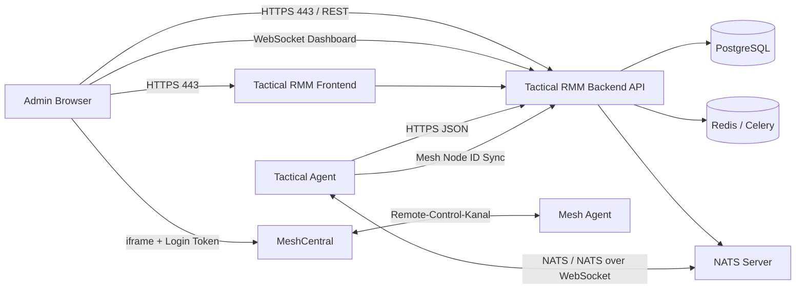
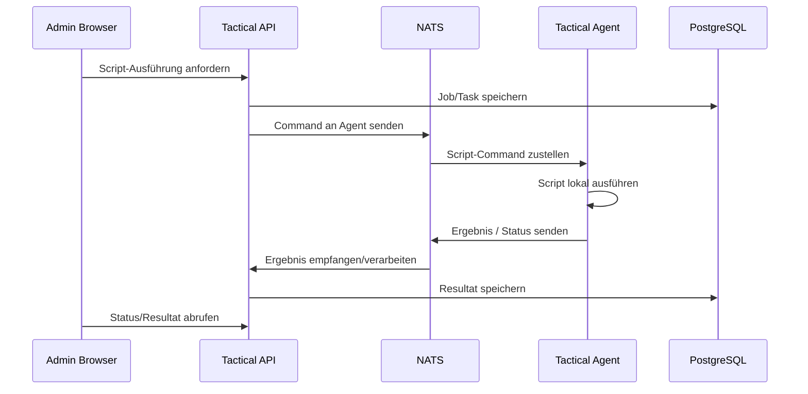
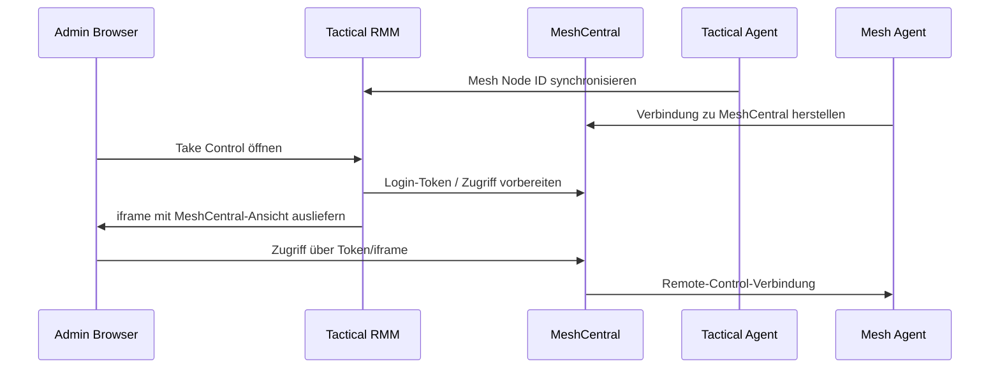
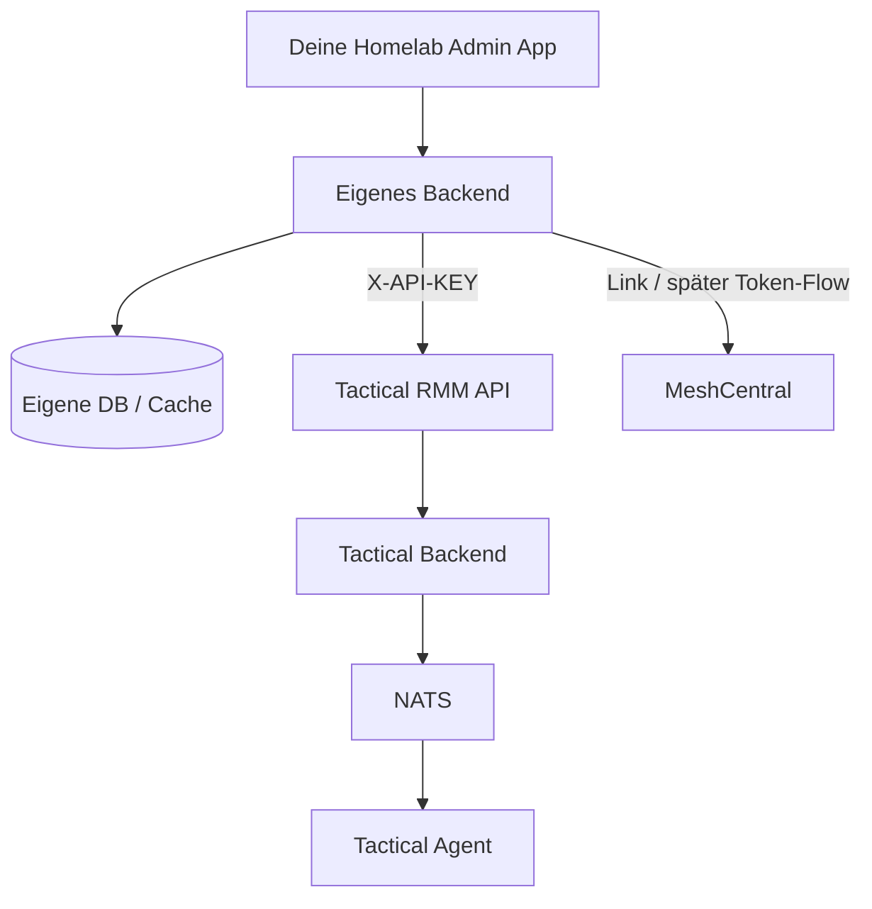

# Tactical RMM: Agentenkommunikation und MeshCentral-Integration

## Ziel der Analyse

Diese Dokumentation fasst zusammen, wie **Tactical RMM** mit seinen Agenten kommuniziert und wie die **MeshCentral-Integration** für Remote-Zugriffe wie Take Control, Remote Shell und File Browser technisch eingeordnet werden kann.

Untersucht wurden die folgenden Quellen:

- GitHub-Repository: <https://github.com/amidaware/tacticalrmm>
- Offizielle Dokumentation: <https://docs.tacticalrmm.com/>

Der Fokus liegt auf:

- Agent-zu-Server-Kommunikation
- Server-zu-Agent-Kommandos
- verwendeten Protokollen und Ports
- Authentifizierung
- Check-ins und Heartbeats
- API-Kommunikation
- NATS / WebSocket-Kommunikation
- MeshCentral-Zugriffsmöglichkeiten
- Konsequenzen für eine eigene Integration in ein Homelab-/Admin-Dashboard

---

## Executive Summary

Tactical RMM nutzt ein **hybrides Kommunikationsmodell**.

Die Agenten kommunizieren nicht nur über eine klassische REST-API. Stattdessen gibt es zwei Hauptwege:

1. **HTTPS/JSON gegen die Tactical-RMM-API**
2. **NATS beziehungsweise NATS-over-WebSocket für Live-Kommunikation**

Zusätzlich nutzt Tactical RMM für bestimmte Remote-Zugriffe **MeshCentral**. Diese Funktionen laufen nicht direkt über den Tactical-Agenten, sondern über den separat installierten Mesh-Agenten.

Vereinfacht sieht die Architektur so aus:

```text
Browser / Admin
   |
   | HTTPS
   v
Tactical RMM Frontend
   |
   | HTTPS / REST / WebSockets
   v
Tactical RMM Backend API
   |
   | NATS / NATS WebSocket
   v
Tactical Agent

Zusätzlich:

Browser / Admin
   |
   | iframe / Login-Token / HTTPS
   v
MeshCentral
   |
   | MeshCentral-Protokoll
   v
Mesh Agent
```

Die wichtigste Erkenntnis:

> Tactical RMM benutzt NATS als Live-Kommunikationskanal zwischen Server und Agent. HTTPS/JSON wird für Installer-, Registrierungs-, Konfigurations- und API-Aufgaben verwendet. MeshCentral ist eine separate Remote-Control-Schicht und sollte nicht mit dem normalen Tactical-Agenten verwechselt werden.

---

## Komponentenübersicht

| Komponente | Aufgabe |
|---|---|
| Tactical RMM Frontend | Weboberfläche, meist Vue-basiert |
| Tactical RMM Backend API | Django-/REST-API für Clients, Agents, Sites, Checks, Tasks usw. |
| PostgreSQL | Datenbank für Tactical-RMM-Daten |
| Redis / Celery | Hintergrundjobs, Queues, asynchrone Verarbeitung |
| NATS | Messaging-Bus für Live-Kommunikation mit Agents |
| Daphne | WebSocket-Komponente für Browser-/Dashboard-Echtzeitfunktionen |
| Tactical Agent | Go-basierter Agent für Monitoring, Checks, Scripts, Tasks, Patching |
| MeshCentral | Separates Remote-Control-System |
| Mesh Agent | Separater Agent für Remote Control, Terminal und File Browser |
| nginx | Reverse Proxy für Frontend, API, WebSockets, MeshCentral und teilweise NATS-WebSocket |

---

## Grobe Kommunikationsarchitektur



---

## Agent-Kommunikation: zwei Hauptpfade

Tactical RMM trennt die Kommunikation funktional.

### 1. HTTPS/JSON

Dieser Pfad wird genutzt für Dinge wie:

- Installer-Handshake
- Agent-Registrierung
- Abrufen von Agent-Konfiguration
- Abrufen oder Herunterladen des Mesh-Agenten
- bestimmte Status- und Konfigurationsdaten
- API-Zugriffe von externen Integrationen

Beobachtbare beziehungsweise dokumentierte Beispiele:

```text
GET  /api/v3/installer/
POST /api/v3/installer/
POST /api/v3/meshexe/
GET  /api/v3/<agentid>/config/
```

Typischer Charakter:

```text
Agent -> HTTPS -> Tactical API
```

Dabei werden JSON-Payloads verwendet. In Logs und Beispielen sieht man Header wie:

```text
Content-Type: application/json
Authorization: Token <agent-token>
```

Für externe API-Integrationen wird dagegen typischerweise ein API-Key über diesen Header verwendet:

```text
X-API-KEY: <api-key>
```

---

### 2. NATS / NATS-over-WebSocket

Dieser Pfad ist für die Live-Kommunikation relevant.

NATS wird genutzt für:

- Live-Kommandos
- Script-Ausführung
- Tasks
- Checks
- Patching-Aktionen
- Heartbeats
- Agent-Status
- kurzfristige Server-zu-Agent-Kommunikation

Die offizielle Doku beschreibt NATS als Messaging-Bus für Live-Kommunikation zwischen Server und Agent.

Typischer Kommunikationsfluss:

```text
Tactical Server -> NATS Command -> Tactical Agent
Tactical Agent  -> NATS Response / Status -> Tactical Server
```

In modernen Setups läuft die Verbindung häufig nicht direkt über den klassischen NATS-Port `4222`, sondern über **NATS-over-WebSocket mit TLS über Port 443**.

Beobachtbare Laufzeitwerte aus Logs zeigen sinngemäß:

```text
NatsServer: wss://api.example.com:443
NatsProxyPath: natsws
NatsProxyPort: 443
NatsWSCompression: true
```

Das bedeutet praktisch:

```text
wss://api.example.com:443/natsws
```

Intern kann nginx diesen WebSocket-Pfad dann an den internen NATS-WebSocket-Port weiterreichen.

---

## Ports und Dienste

Eine typische Tactical-RMM-Installation arbeitet mit mehreren internen und externen Ports.

| Zweck | Typischer Dienst | Port | Extern sichtbar? |
|---|---:|---:|---|
| Tactical RMM Frontend | nginx / Web UI | 443 | Ja |
| Tactical API | nginx -> Django/uWSGI | 443 | Ja |
| Agent API | Tactical API | 443 | Ja |
| NATS klassisch | nats-server | 4222 | Normalerweise nein |
| NATS WebSocket | nats-server WebSocket | 9235 | Normalerweise nein, via 443 proxied |
| MeshCentral extern | nginx -> MeshCentral | 443 | Ja |
| MeshCentral intern | MeshCentral | 4430 | Normalerweise nein |
| Browser Dashboard WebSocket | Daphne | über nginx | Ja, über 443 |

Wichtig:

> Für Agenten ist nach außen in vielen Standard-Setups primär Port 443 relevant. Dahinter verbergen sich API, NATS-WebSocket und MeshCentral über unterschiedliche Domains oder Pfade.

---

## Typische Tactical-RMM-Domains

Tactical RMM arbeitet üblicherweise mit drei getrennten Hostnames/Subdomains:

```text
rmm.example.com   -> Frontend / Web UI
api.example.com   -> Backend API / Agent-Kommunikation / NATS-WebSocket
mesh.example.com  -> MeshCentral
```

Das ist wichtig, weil Agenten und Browser nicht einfach nur gegen eine einzige URL arbeiten. Je nach Funktion wird ein anderer Hostname genutzt.

---

## Agent-Authentifizierung

Die Agent-Kommunikation verwendet unterschiedliche Authentifizierungsmechanismen je nach Transportweg.

### HTTPS/API-Agent-Requests

Für Agent-Requests gegen die API werden Token genutzt.

Vereinfacht:

```text
Authorization: Token <agent-token>
```

Damit identifiziert sich der Agent gegenüber der Tactical-RMM-API.

---

### NATS-Authentifizierung

Für NATS werden Agent-ID und Token verwendet.

Aus Logs ist sinngemäß erkennbar:

```text
User:     <AgentID>
Password: <Token>
```

Das heißt:

```text
AgentID + Token -> NATS Login
```

Der Agent verbindet sich also nicht anonym mit NATS. Der Server kann dadurch einordnen, welcher Agent verbunden ist.

---

### Externe API-Authentifizierung

Für eine eigene Integration in dein Dashboard ist wichtig:

```text
X-API-KEY: <api-key>
```

Das ist der sauberste Weg, Tactical RMM aus einer Fremdanwendung abzufragen.

Beispiel:

```bash
curl https://api.example.com/clients/ \
  -H "X-API-KEY: <API_KEY>"
```

Hinweis:

> API-Keys sollten wie Passwörter behandelt werden. Wenn ein API-Key in deiner eigenen App hinterlegt wird, sollte er verschlüsselt gespeichert und niemals im Frontend ausgeliefert werden.

---

## Nachrichtenfluss bei Agent-Aktionen

### Beispiel: Script auf Agent ausführen

Ein typischer Ablauf kann so aussehen:

```text
1. Admin klickt im Tactical-RMM-Webinterface auf "Script ausführen".
2. Frontend sendet Request an Tactical API.
3. API legt Aktion / Task / Job serverseitig an.
4. Server sendet über NATS ein Kommando an den Agenten.
5. Agent empfängt das Kommando.
6. Agent führt das Script lokal aus.
7. Agent sendet Ergebnis zurück.
8. Backend speichert Ergebnis in Datenbank.
9. Frontend zeigt Status und Ergebnis an.
```

Als Diagramm:



---

## Check-ins und Heartbeats

Der Agent sendet regelmäßig Informationen an den Server.

Die Doku nennt verschiedene Check-in-Intervalle, unter anderem:

| Check-in | Zweck |
|---|---|
| `CHECKIN_HELLO` | Heartbeat / Agent lebt |
| `CHECKIN_AGENTINFO` | Basisinformationen wie Hostname, User, OS, RAM, Bootzeit |
| `CHECKIN_WINSVC` | Windows-Dienste |
| `CHECKIN_PUBIP` | öffentliche IP |
| `CHECKIN_DISKS` | Laufwerksinformationen |
| `CHECKIN_SW` | installierte Software |
| `CHECKIN_WMI` | WMI-/Hardware-/Assetdaten |
| `CHECKIN_SYNCMESH` | Synchronisation der MeshCentral-Node-ID |

Die Intervalle sind nicht bei jedem Agenten exakt identisch. Tactical RMM nutzt zufällige Intervalle beziehungsweise Jitter, damit nicht alle Agenten gleichzeitig einchecken.

Das verhindert einen sogenannten **Thundering-Herd-Effekt**.

Beispiel:

```text
Agent A checkt nach 31 Sekunden ein
Agent B checkt nach 42 Sekunden ein
Agent C checkt nach 37 Sekunden ein
```

Statt:

```text
Alle 500 Agenten checken exakt alle 30 Sekunden gleichzeitig ein
```

---

## Beobachtbare Agent-Meldungen

In Logs wurden unter anderem folgende Meldungen beobachtet:

```text
agent-hello
agent-agentinfo
agent-disks
```

Das deutet auf ein `agent-*`-Namensschema für bestimmte Check-ins hin.

Wichtig:

> Nicht alle internen Subject-Namen und RPC-Funktionsnamen sind in den betrachteten Quellen vollständig dokumentiert. Für eine saubere externe Integration sollte man deshalb nicht versuchen, das komplette Agent-Protokoll nachzubauen.

---

## Server-zu-Agent-Kommandos

Über NATS können serverseitige Aktionen an Agents gepusht werden.

Typische Funktionsbereiche:

- Script ausführen
- Task ausführen
- Checks ausführen
- Windows Updates suchen
- Windows Updates installieren
- Dienste abfragen
- Dienste starten/stoppen
- Systeminformationen neu abrufen
- Agent aktualisieren
- Agent deinstallieren
- Neustart oder Shutdown anstoßen

Die genaue interne RPC-Namensliste ist in den erlaubten Quellen nicht vollständig spezifiziert. Aus der Architektur ist aber klar:

```text
Live-Aktion = Tactical API / Backend -> NATS -> Tactical Agent
```

---

## Was läuft über HTTPS und was läuft über NATS?

| Funktion | Wahrscheinlicher/Belegter Transport | Bewertung |
|---|---|---|
| Agent-Installer validieren | HTTPS/JSON | belegt |
| Agent registrieren | HTTPS/JSON | belegt |
| Agent-Konfiguration abrufen | HTTPS/JSON | belegt |
| Mesh-Agent-Binary abrufen | HTTPS/JSON | belegt |
| Heartbeat / Online-Status | NATS / NATS-WebSocket | dokumentiert/beobachtet |
| Live-Script starten | NATS | dokumentiert |
| Check ausführen | NATS | dokumentiert |
| Task ausführen | NATS | dokumentiert |
| Patch-Aktionen | NATS + API/DB-Verarbeitung | dokumentiert |
| Ergebnisse speichern | API/Backend/DB | architektonisch naheliegend |
| Remote Control | MeshCentral | dokumentiert |
| Remote Terminal | MeshCentral | dokumentiert |
| File Browser | MeshCentral | dokumentiert |

---

## NATS genauer erklärt

NATS ist ein leichtgewichtiger Messaging-Bus. In Tactical RMM wird er verwendet, damit der Server Agenten direkt erreichen kann, ohne darauf warten zu müssen, dass der Agent irgendwann wieder klassisch per HTTP pollt.

Das Prinzip:

```text
Agent verbindet sich dauerhaft mit NATS.
Server veröffentlicht eine Nachricht.
Agent empfängt diese Nachricht fast in Echtzeit.
Agent verarbeitet die Aktion.
Agent sendet Status oder Ergebnis zurück.
```

Vorteil:

- schnelle Reaktion
- weniger Polling
- Live-Kommandos möglich
- geeignet für viele Agents

Nachteil:

- internes Protokoll ist schwieriger nachzubauen
- Authentifizierung und Subject-Struktur müssen exakt passen
- direkte Integration auf dieser Ebene ist bruchanfällig

---

## NATS-over-WebSocket

Klassisches NATS nutzt normalerweise TCP-Port `4222`.

Für RMM-Agenten ist das aber unpraktisch, weil viele Netzwerke ausgehend nur HTTP/HTTPS erlauben.

Deshalb nutzt Tactical RMM in modernen Setups NATS über WebSocket/TLS.

Das sieht dann aus wie normaler HTTPS-Traffic:

```text
wss://api.example.com:443/natsws
```

Vorteile:

- funktioniert oft durch Firewalls
- nur Port 443 nach außen nötig
- kann über nginx reverse-proxied werden
- TLS ist direkt integriert

---

## Browser-WebSockets sind nicht gleich Agent-NATS

Tactical RMM nutzt zusätzlich Browser-WebSockets für Dashboard-Echtzeitdaten.

Diese laufen über andere Pfade, zum Beispiel sinngemäß:

```text
/ws/dashinfo/?access_token=...
```

Das ist nicht dasselbe wie die Agent-NATS-Verbindung.

Unterscheidung:

| Verbindung | Zweck |
|---|---|
| Browser -> Daphne/WebSocket | Live-Dashboard, UI-Aktualisierungen |
| Agent -> NATS-WebSocket | Live-Kommunikation Agent/Server |
| Browser -> API | normale UI-/REST-Anfragen |
| Agent -> API | Installer, Config, Registrierung, Daten |

---

## MeshCentral-Integration

Tactical RMM nutzt MeshCentral für Remote-Zugriffe.

Die wichtigsten Funktionen sind:

- **Take Control**
- **Real-time Shell**
- **Real-time File Browser**

Diese Funktionen laufen nicht über den normalen Tactical-Agenten, sondern über den Mesh-Agenten.

---

## Tactical Agent vs. Mesh Agent

| Agent | Aufgabe |
|---|---|
| Tactical Agent | Monitoring, Checks, Scripts, Tasks, Patching, Inventory |
| Mesh Agent | Remote Control, Terminal, File Browser |

Das ist eine sehr wichtige Trennung.

Wenn du also in Tactical RMM auf „Take Control“ klickst, benutzt du nicht einfach nur den Tactical-Agenten. Tactical RMM springt über die MeshCentral-Integration zum passenden Mesh-Agenten.

---

## MeshCentral-Datenfluss

Vereinfacht:

```text
1. Tactical Agent installiert oder triggert Mesh-Agent-Setup.
2. Mesh-Agent verbindet sich mit MeshCentral.
3. Tactical Agent synchronisiert die Mesh-Node-ID mit Tactical RMM.
4. Tactical RMM weiß dadurch, welcher Tactical-Agent zu welchem MeshCentral-Gerät gehört.
5. Admin klickt auf Take Control / Terminal / File Browser.
6. Tactical RMM erzeugt einen Login-Token für MeshCentral.
7. Tactical RMM öffnet die passende MeshCentral-Ansicht eingebettet im iframe.
8. Der eigentliche Remote-Zugriff läuft über MeshCentral und Mesh Agent.
```

Als Diagramm:



---

## MeshCentral-Authentifizierung und Zugriff

Tactical RMM bettet MeshCentral nicht einfach statisch ein. Stattdessen wird beim Zugriff ein Token erzeugt.

Das Prinzip:

```text
Tactical RMM erzeugt Login-Token
-> Browser öffnet MeshCentral-Ansicht
-> MeshCentral akzeptiert Token
-> Zugriff auf den passenden Mesh-Agenten
```

Dadurch muss der Benutzer nicht separat manuell in MeshCentral navigieren.

Wichtig ist aber:

> MeshCentral bleibt technisch ein eigenes System. Tactical RMM nutzt MeshCentral, kontrolliert aber nicht jeden internen MeshCentral-Mechanismus direkt.

---

## Was passiert bei Installation ohne Mesh?

Wenn ein Tactical-Agent ohne MeshCentral-Komponente installiert wird, funktionieren bestimmte Remote-Funktionen nicht.

Typische betroffene Funktionen:

- Take Control
- Remote Shell über MeshCentral
- File Browser über MeshCentral

Monitoring, Checks und Scripts über den Tactical-Agenten können davon getrennt weiterhin funktionieren.

---

## Warum Tactical RMM MeshCentral separat behandelt

MeshCentral ist auf Remote-Zugriff spezialisiert. Tactical RMM muss diese Funktionen daher nicht selbst vollständig implementieren.

Vorteile:

- fertige Remote-Control-Funktionalität
- Terminal und File Browser bereits vorhanden
- eigene MeshCentral-Agentenlogik
- bewährte Remote-Management-Komponente

Nachteile:

- zusätzliche Komplexität
- zweiter Agent
- zweite Identität pro Gerät: Tactical-Agent-ID und Mesh-Node-ID
- Fehleranalyse muss beide Systeme berücksichtigen
- Reverse Proxy / Zertifikate / Domains müssen sauber stimmen

---

## Praktische Bedeutung für dein eigenes Dashboard

Wenn du Tactical RMM in deine eigene Homelab-/Admin-Plattform integrieren willst, solltest du Tactical RMM nicht auf Agent-Protokollebene nachbauen.

Der saubere Weg:

```text
Deine App -> Tactical RMM API -> Tactical RMM Backend -> Agenten
```

Nicht empfohlen als erster Ansatz:

```text
Deine App -> direkt auf NATS -> Agent-Kommandos selbst senden
```

Warum?

Weil für eine direkte NATS-Integration viele interne Details exakt passen müssen:

- Subject-Namensschema
- Payload-Encoding
- erwartete Response-Struktur
- Authentifizierungsformat
- Agent-State-Handling
- Version-Kompatibilität
- Fehlerbehandlung
- serverseitige Datenbank-Synchronisation

Wenn du diese Ebene falsch nutzt, kannst du sehr schnell inkonsistente Zustände erzeugen.

---

## Sinnvolle Integration in deine App

Für dein Dashboard wären diese Funktionen realistisch und sinnvoll:

### 1. Hostliste aus Tactical RMM anzeigen

```text
Tactical API -> Clients / Sites / Agents abrufen
```

In deiner App könntest du anzeigen:

- Hostname
- Client
- Site
- Betriebssystem
- letzter Check-in
- Online/Offline
- Agent-Version
- öffentliche IP
- lokale IP
- angemeldeter Benutzer

---

### 2. Agent-Status anzeigen

Mögliche UI-Karten:

```text
🟢 Online
🟡 lange nicht gesehen
🔴 Offline
⚠️ Agent veraltet
⚠️ Mesh nicht verbunden
```

---

### 3. Asset-Informationen anzeigen

Aus Tactical RMM könntest du Assetdaten übernehmen:

- CPU
- RAM
- Laufwerke
- OS-Version
- Seriennummer
- Hersteller
- Modell
- installierte Software
- Dienste
- Windows Updates

---

### 4. Direktlinks zu Tactical RMM

Sehr sinnvoll wäre ein Button:

```text
In Tactical öffnen
```

Damit springst du aus deiner App direkt auf den Host in Tactical RMM.

---

### 5. MeshCentral-Remote-Zugriff nicht nachbauen, sondern verlinken

Für Remote Control würde ich erstmal nicht versuchen, den iframe-/Token-Mechanismus selbst zu bauen.

Besser:

```text
Button: Remote Control in Tactical öffnen
Button: MeshCentral öffnen
```

Später kannst du prüfen, ob du den Token-/iframe-Fluss sauber integrieren kannst.

---

### 6. Scripts und Tasks über Tactical API starten

Wenn die API-Endpunkte sauber identifiziert sind, könntest du aus deiner App Aktionen anstoßen:

- Script starten
- Task starten
- Check starten
- Patch-Scan auslösen
- Agent-Info aktualisieren

Aber:

> Diese Aktionen sollten immer über Tactical RMM selbst laufen, nicht direkt über NATS.

---

## Beispielarchitektur für deine App



---

## Empfohlene Datenbankstruktur für deine Integration

Wenn du Tactical-RMM-Daten in deiner eigenen App cachen willst, könntest du eine Tabelle wie diese verwenden:

```sql
CREATE TABLE tactical_agents_cache (
    id INTEGER PRIMARY KEY AUTOINCREMENT,
    tactical_agent_id TEXT NOT NULL UNIQUE,
    hostname TEXT,
    client_name TEXT,
    site_name TEXT,
    operating_system TEXT,
    agent_version TEXT,
    mesh_node_id TEXT,
    local_ip TEXT,
    public_ip TEXT,
    last_seen DATETIME,
    online BOOLEAN,
    raw_json TEXT,
    updated_at DATETIME DEFAULT CURRENT_TIMESTAMP
);
```

Warum cachen?

- deine App lädt schneller
- Tactical RMM wird nicht ständig abgefragt
- du kannst eigene Labels, Tags und Notizen ergänzen
- du kannst Tactical-Daten mit Wazuh, SSH/RDP-Manager oder NetBox verknüpfen

---

## Sicherheitsbetrachtung

### API-Key-Schutz

Der Tactical-RMM-API-Key darf niemals im Frontend liegen.

Richtig:

```text
Frontend -> dein Backend -> Tactical API
```

Falsch:

```text
Frontend -> Tactical API mit sichtbarem API-Key
```

---

### Rechtebegrenzung

Wenn Tactical RMM API-Keys mit bestimmten Rollen/Rechten unterstützt, sollte ein dedizierter Integrationsbenutzer genutzt werden.

Empfehlung:

```text
User: dashboard-integration
Rechte: nur lesen, später gezielt Aktionen erlauben
```

---

### Audit Logging

Alle Aktionen aus deiner App sollten protokolliert werden.

Beispiel:

```text
2026-05-12 12:44:01 user=colin action=start_script target=PC-123 source=dashboard
```

Das ist besonders wichtig, wenn du später Scripts, Reboots oder Remote-Aktionen aus deiner eigenen Oberfläche starten willst.

---

### Keine direkte NATS-Steuerung im Produktivbetrieb

Direkte NATS-Steuerung wäre nur für Forschung/Lab sinnvoll.

Im Produktivbetrieb ist das riskant, weil:

- Tactical RMM interne Zustände erwartet
- Ergebnisse eventuell nicht korrekt in der Datenbank landen
- Versionsupdates interne Payloads ändern können
- falsche Messages Agents beschädigen oder inkonsistente Jobs erzeugen können

---

## Troubleshooting-Punkte

Bei Agent-Kommunikationsproblemen solltest du diese Bereiche prüfen:

### DNS

```text
rmm.example.com
api.example.com
mesh.example.com
```

Alle Namen müssen vom Agenten erreichbar sein.

---

### TLS/Zertifikate

Der Agent muss dem Zertifikat vertrauen.

Typische Probleme:

- falscher Common Name / SAN
- abgelaufenes Zertifikat
- interne CA nicht vertraut
- TLS-Inspection durch Firewall/AV

---

### Port 443

Vom Agenten aus sollte Port 443 zu den Tactical-RMM-Domains erreichbar sein.

Test:

```powershell
Test-NetConnection api.example.com -Port 443
Test-NetConnection mesh.example.com -Port 443
```

---

### NATS-WebSocket

Wenn Agenten offline angezeigt werden, obwohl HTTPS funktioniert, kann das Problem beim NATS-WebSocket liegen.

Prüfen:

- nginx WebSocket-Proxy
- Pfad `natsws`
- Zertifikat
- Reverse-Proxy-Konfiguration
- Firewall
- NATS-Dienst

---

### MeshCentral

Wenn Remote Control nicht funktioniert, aber Monitoring schon, liegt das Problem wahrscheinlich eher bei MeshCentral als beim Tactical-Agenten.

Prüfen:

- MeshCentral-Dienst läuft
- Mesh-Agent installiert
- Mesh-Agent online
- Mesh-Node-ID synchronisiert
- `mesh.example.com` erreichbar
- interner MeshCentral-Port korrekt
- iframe / Token-Flow funktioniert

---

## Abgrenzung: Was ist belegt und was ist nicht vollständig belegt?

### Belegt / stark belegt

- Tactical RMM nutzt NATS für Live-Agent-Kommunikation.
- Tactical RMM nutzt HTTPS/JSON für Installer-, Config- und API-Aufrufe.
- NATS kann über WebSocket/TLS auf Port 443 laufen.
- Der beobachtete NATS-Proxy-Pfad lautet `natsws`.
- Agenten nutzen Agent-ID und Token für NATS.
- Externe API-Zugriffe nutzen `X-API-KEY`.
- MeshCentral ist ein separates System.
- Take Control, Remote Shell und File Browser laufen über MeshCentral.
- Tactical RMM bettet MeshCentral per Token/iframe ein.
- Tactical Agent und Mesh Agent sind unterschiedliche Komponenten.

### Nicht vollständig spezifiziert in den betrachteten Quellen

- vollständige interne NATS-Subject-Struktur
- vollständige RPC-Funktionsliste
- vollständiges Payload-Encoding für alle NATS-Messages
- exakter Codepfad für alle Agent-Kommandos
- vollständige serverseitige Verarbeitung jeder Agent-Response
- vollständiger Token-Flow von Tactical RMM zu MeshCentral auf Codeebene

---

## Empfehlung für weitere Analyse

Wenn du noch tiefer gehen willst, wäre der nächste sinnvolle Schritt nicht nur das Tactical-RMM-Repo, sondern auch das eigentliche Agent-Repository zu analysieren.

Relevante Suchbegriffe wären:

```text
nats.Connect
Subscribe
Publish
NatsServer
NatsProxyPath
AgentID
Token
msgpack
rpc
syncmesh
```

Außerdem wäre eine kontrollierte Lab-Analyse sinnvoll:

```text
1. Tactical RMM Testinstanz aufsetzen
2. Windows-Testagent installieren
3. Agent-Logs aktivieren
4. nginx Access Logs beobachten
5. NATS-Verbindung prüfen
6. Script-Ausführung starten
7. Netzwerkfluss dokumentieren
8. MeshCentral Remote Control testen
```

---

## Konkretes Fazit

Tactical RMM verwendet für Agenten kein simples Polling-Modell. Die Architektur ist moderner und besteht aus mehreren Schichten:

```text
HTTPS/API      -> Registrierung, Installer, Config, Datenabruf
NATS/WSS       -> Live-Kommandos, Status, Heartbeats
PostgreSQL     -> persistente Daten
Redis/Celery   -> Hintergrundjobs
MeshCentral    -> Remote Control, Terminal, File Browser
```

Für deine eigene Homelab-Management-Plattform bedeutet das:

1. **Tactical RMM über die API integrieren.**
2. **NATS nicht direkt nachbauen, außer im Lab zur Forschung.**
3. **MeshCentral als separate Remote-Control-Schicht behandeln.**
4. **Tactical-Agent und Mesh-Agent getrennt anzeigen.**
5. **Eigene App als übergeordnetes Dashboard bauen, nicht als Ersatz für Tactical RMM intern.**

Die beste Zielarchitektur für dich wäre:

```text
Eigene App
  ├── Wazuh-Integration
  ├── SSH/RDP-Manager
  ├── Tactical-RMM-API-Integration
  ├── Agent-/Host-Übersicht
  ├── Risiko-/Statusbewertung
  ├── Direktlinks zu Tactical / MeshCentral
  └── später kontrollierte Aktionen über Tactical API
```

Damit bekommst du eine zentrale Oberfläche, ohne die internen und potenziell fragilen Kommunikationswege von Tactical RMM direkt zu imitieren.

---

## Ergänzung: Integrationskonzept für eine eigene App

Dieser Abschnitt beschreibt, wie Tactical RMM sinnvoll in eine eigene Homelab-, Admin- oder Security-Dashboard-App integriert werden kann. Ziel ist nicht, Tactical RMM intern nachzubauen, sondern Tactical RMM als bestehendes RMM-Backend kontrolliert und sicher auszuwerten.

Die eigene App sollte Tactical RMM primär als Datenquelle und Aktionssystem behandeln:

```text
Eigene App
  |
  | HTTPS / API-Key
  v
Tactical RMM API
  |
  +--> Tactical-Agenten
  +--> Checks / Tasks / Scripts
  +--> Patch-Informationen
  +--> Asset-Daten
  +--> MeshCentral-Verweise
```

Die direkte Kommunikation mit NATS oder die direkte Nachbildung des MeshCentral-Token-Flows sollte für die erste Version vermieden werden. Diese internen Kommunikationswege sind stärker an Tactical RMM gekoppelt und können sich eher ändern als die Web-/API-Schicht.

---

## 1. Konkrete API-Endpunkte, die deine App später braucht

Die offizielle Tactical-RMM-API ist nicht in allen Bereichen vollständig als öffentliche Integrations-API dokumentiert. Die Doku empfiehlt selbst, die Endpunkte über den Browser-Network-Tab der Tactical-RMM-Oberfläche zu beobachten. Für deine App bedeutet das: Du solltest die Endpunkte erst in einer Testinstanz prüfen und dann sauber in deinem Backend kapseln.

### Grundprinzip für API-Zugriff

```http
GET https://api.example.local/<endpoint>/
X-API-KEY: <TACTICAL_API_KEY>
Accept: application/json
```

Der API-Key sollte niemals im Frontend liegen. Deine eigene App sollte ihn nur serverseitig verwenden.

```text
Browser
  |
  | eigene Session / JWT
  v
Deine App Backend
  |
  | X-API-KEY
  v
Tactical RMM API
```

### Wahrscheinlich benötigte API-Bereiche

| Bereich | Zweck in deiner App | Priorität |
|---|---|---:|
| Clients | Kunden-/Mandantenstruktur anzeigen | Hoch |
| Sites | Standorte / Gruppen anzeigen | Hoch |
| Agents | Hostliste, Agentstatus, Betriebssystem, letzte Verbindung | Sehr hoch |
| Checks | Monitoring-Ergebnisse und Fehlerzustände anzeigen | Hoch |
| Tasks | geplante Aufgaben sichtbar machen | Mittel |
| Scripts | vorhandene Scripts inventarisieren, später ggf. ausführen | Mittel |
| Alerts | offene Probleme anzeigen | Hoch |
| Software | installierte Software je Host anzeigen | Mittel |
| Windows Updates / Patches | Patchstatus anzeigen | Hoch |
| Services | Windows-Dienste anzeigen | Mittel |
| Mesh / Remote Control | Direktlinks oder Kontext für Remote-Zugriff | Mittel |

### Praktische Endpunkt-Kandidaten

Die genauen Pfade solltest du in deiner Tactical-RMM-Version über die Developer Tools prüfen. Als Arbeitsmodell kannst du diese API-Bereiche einplanen:

```text
/api/clients/
/api/sites/
/api/agents/
/api/checks/
/api/tasks/
/api/scripts/
/api/alerts/
/api/software/
/api/winupdates/
/api/services/
```

Wichtig: Die tatsächlich verwendeten Pfade können je nach Tactical-RMM-Version und Frontend-Route leicht anders heißen. Deshalb sollte deine App einen kleinen Tactical-Connector bekommen, der die Pfade zentral verwaltet.

Beispielstruktur:

```text
backend/src/integrations/tactical/
  tactical.client.ts       -> HTTP-Client mit API-Key
  tactical.types.ts        -> TypeScript-Typen
  tactical.mapper.ts       -> Normalisierung in dein Host-Modell
  tactical.cache.ts        -> Cache-Logik
  tactical.actions.ts      -> erlaubte Aktionen
```

### Minimaler API-Read-Plan für Version 1

Für die erste Version deiner App reicht wahrscheinlich:

| API-Daten | Verwendung |
|---|---|
| Clients | Struktur / Filter |
| Sites | Struktur / Filter |
| Agents | zentrale Hostliste |
| Agent Detail | OS, Hostname, IP, User, Status, letzter Check-in |
| Checks | Health-Status pro Host |
| Alerts | offene Probleme |
| Patchstatus | fehlende Updates / Risikoansicht |

Damit kannst du bereits ein gutes Dashboard bauen, ohne gefährliche Remote-Aktionen zu erlauben.

---

## 2. Welche Daten du aus Tactical cachen willst

Deine App sollte nicht bei jedem Seitenaufruf alle Daten live aus Tactical RMM ziehen. Besser ist ein kontrollierter Cache. Das entlastet Tactical RMM, macht dein Dashboard schneller und gibt dir eine stabile Datenbasis für Matching mit Wazuh.

### Empfohlene Cache-Tabellen

```text
cached_tactical_hosts
cached_tactical_checks
cached_tactical_alerts
cached_tactical_patches
cached_tactical_software
cached_tactical_services
cached_tactical_sites
cached_tactical_clients
```

### Hostdaten

| Feld | Warum cachen? | Aktualisierung |
|---|---|---:|
| Tactical Agent ID | Primärer Bezug zu Tactical | selten / dauerhaft |
| Hostname | Matching mit Wazuh und Anzeige | alle 5-15 Min. |
| FQDN | besseres Matching mit AD/Wazuh | alle 5-15 Min. |
| lokale IPs | Netzwerkübersicht / Matching | alle 5-15 Min. |
| öffentliche IP | Standort-/Remote-Kontext | alle 15-60 Min. |
| Betriebssystem | Inventar | täglich |
| OS-Version / Build | Patch- und Risikoansicht | täglich |
| letzter Check-in | Online-/Offline-Status | alle 1-5 Min. |
| Agent-Version | Update-/Kompatibilitätsstatus | täglich |
| logged-in user | Support-Kontext | alle 5-15 Min. |
| Site / Client | Gruppierung | täglich oder bei Änderung |
| Mesh Node ID | Remote-Control-Zuordnung | alle 15-60 Min. |

### Checks und Alerts

Checks und Alerts sind für dein Dashboard wichtiger als vollständige Rohdaten.

| Daten | Cache-Zweck | Aktualisierung |
|---|---|---:|
| offene Alerts | zentrale Problemübersicht | 1-5 Min. |
| Checkstatus je Host | Health-Badge grün/gelb/rot | 1-5 Min. |
| letzter Checklauf | Verlässlichkeit der Daten | 5 Min. |
| Check-Ausgabe | Fehlerdiagnose | 5-15 Min. |
| Severity / Status | Priorisierung | 1-5 Min. |

### Patchdaten

Patchdaten müssen nicht sekündlich aktuell sein, sind aber sicherheitsrelevant.

| Daten | Cache-Zweck | Aktualisierung |
|---|---|---:|
| fehlende Updates | Risikoübersicht | 1-6 Std. |
| installierte Updates | Nachweis / Verlauf | täglich |
| Neustart erforderlich | Betriebsrisiko | 15-60 Min. |
| Patch-Installationsstatus | Wartungsfenster-Auswertung | 15-60 Min. |

### Software-Inventar

Das Software-Inventar ist groß und ändert sich nicht ständig. Deshalb sollte es nicht permanent neu geladen werden.

| Daten | Cache-Zweck | Aktualisierung |
|---|---|---:|
| installierte Software | Inventar / Schwachstellen-Mapping | täglich |
| Versionen | CVE-/Risikoabgleich | täglich |
| Publisher | Filter / Lizenzübersicht | täglich |
| Installationsdatum | Änderungserkennung | täglich |

### Services

Services sind nützlich, aber können sehr viele Einträge erzeugen. Deshalb nur selektiv oder pro Host on-demand laden.

| Daten | Cache-Zweck | Aktualisierung |
|---|---|---:|
| kritische Dienste | Monitoring / Risikoansicht | 15-60 Min. |
| kompletter Servicestatus | Detailansicht | on-demand |
| Starttyp | Fehlersuche | täglich |

### Cache-Strategie

Empfohlenes Modell:

```text
1. Hintergrundjob lädt Tactical-Daten zyklisch.
2. Daten werden normalisiert in eigener DB gespeichert.
3. Frontend liest nur deine eigene DB.
4. Manuelle Refresh-Buttons triggern gezielte Aktualisierung.
5. Gefährliche Aktionen gehen nie direkt aus der Liste heraus, sondern über Bestätigungsdialoge.
```

Beispielintervalle:

| Job | Intervall |
|---|---:|
| Tactical Hosts Sync | alle 5 Minuten |
| Tactical Alerts Sync | alle 2 Minuten |
| Tactical Checks Sync | alle 5 Minuten |
| Tactical Patch Sync | alle 1-6 Stunden |
| Tactical Software Sync | 1x täglich nachts |
| Tactical Services Sync | on-demand oder alle 60 Minuten |
| Wazuh Host Sync | alle 5 Minuten |
| Wazuh Alerts Sync | alle 1-2 Minuten |
| Host Matching Job | nach jedem Tactical/Wazuh-Sync |

---

## 3. Welche Aktionen nur read-only sein sollen

Für die erste Version deiner App sollte Tactical RMM fast vollständig read-only eingebunden werden. Das reduziert Risiko und macht die App deutlich sicherer.

### Read-only in Version 1

| Funktion | Warum read-only? |
|---|---|
| Hostliste anzeigen | ungefährlich, hoher Nutzen |
| Agentstatus anzeigen | ungefährlich |
| letzter Check-in | wichtig für Monitoring |
| Checks anzeigen | wichtig für Fehlerübersicht |
| Alerts anzeigen | wichtig für Dashboard |
| Patchstatus anzeigen | wichtig für Security-Übersicht |
| installierte Software anzeigen | nützlich für Inventar |
| Dienste anzeigen | nützlich für Diagnose |
| Mesh-Status anzeigen | nützlich für Remote-Kontext |
| Links zu Tactical öffnen | sicherer als Aktionen nachzubauen |
| Links zu MeshCentral/Tactical Take Control öffnen | besser als Token-Handling selbst zu bauen |

### Warum read-only zuerst sinnvoll ist

Eine eigene App kann schnell gefährlich werden, wenn sie RMM-Funktionen steuert. Tactical RMM kann auf Clients Befehle ausführen, Scripts starten, Dienste stoppen, Updates installieren und Systeme neu starten. Wenn deine App einen Bug in Rollen/Rechten oder Matching hat, kann aus einem Dashboard sehr schnell ein Massenverwaltungsproblem werden.

Deshalb:

```text
Version 1: Nur anzeigen
Version 2: sichere Einzelaktionen
Version 3: kontrollierte Bulk-Aktionen mit Freigabe
```

### Sichere Aktionen für Version 2

Diese Aktionen wären später relativ gut kontrollierbar:

| Aktion | Risiko | Empfehlung |
|---|---|---|
| Host in Tactical öffnen | niedrig | erlauben |
| MeshCentral/Tactical Remote-Control öffnen | mittel | nur für Admins |
| Check neu ausführen | niedrig bis mittel | mit Bestätigung |
| Agent-Daten refreshen | niedrig | erlauben |
| Softwareliste refreshen | niedrig | erlauben |
| Patchscan starten | mittel | nur mit Bestätigung |
| Service-Status neu laden | niedrig | erlauben |

---

## 4. Gefährliche Aktionen und Sicherheitsmodell

Ein RMM-System hat sehr hohe Rechte auf den verwalteten Clients. Deshalb sollten bestimmte Aktionen in deiner eigenen App besonders geschützt oder am Anfang komplett deaktiviert werden.

### Gefährliche Aktionen

| Aktion | Risiko | Empfehlung |
|---|---|---|
| Reboot | Unterbricht Arbeit, kann Serverdienste stören | nur Admin, immer Bestätigung |
| Shutdown | System nicht mehr erreichbar | standardmäßig deaktivieren |
| Script ausführen | beliebiger Code möglich | erst später, stark absichern |
| Raw Command / Shell Command | sehr hohes Risiko | nicht in Version 1 |
| Patch installieren | kann Neustarts / Fehler auslösen | nur Wartungsfenster |
| Service stoppen | kann Fachanwendungen lahmlegen | nur mit Warnung |
| Service starten/neustarten | kann Seiteneffekte haben | nur gezielt |
| Agent deinstallieren | Host fällt aus Management | deaktivieren |
| Mesh Take Control | Zugriff auf Benutzersitzung | nur berechtigte Admins |
| File Browser | Zugriff auf Dateien | nur berechtigte Admins |
| Remote Terminal | hohe Rechte möglich | nur berechtigte Admins |

### Empfohlenes Rechtemodell deiner App

```text
Viewer
  - darf Hosts, Checks, Alerts und Patchstatus sehen
  - darf keine Aktionen ausführen

Operator
  - darf Checks neu starten
  - darf Detaildaten aktualisieren
  - darf Tactical-Links öffnen
  - darf keine Scripts oder Reboots auslösen

Admin
  - darf Remote-Control öffnen
  - darf Patchscan starten
  - darf ausgewählte Services neu starten
  - darf einzelne Hosts rebooten

Breakglass Admin
  - darf gefährliche Aktionen ausführen
  - braucht zusätzliche Bestätigung
  - alle Aktionen werden audit-logpflichtig
```

### Schutzmechanismen

Für jede schreibende Aktion sollte gelten:

```text
1. Benutzer muss berechtigt sein.
2. Aktion muss serverseitig erlaubt sein.
3. Host muss eindeutig gematcht sein.
4. Aktion muss einzeln bestätigt werden.
5. Bulk-Aktionen brauchen eine zweite Bestätigung.
6. Aktion wird mit Benutzer, Zeit, Host, Payload und Ergebnis geloggt.
7. Bei kritischen Aktionen wird optional ein Kommentar verlangt.
```

### Beispiel für einen Bestätigungsdialog

```text
Aktion: Reboot auslösen
Host: PC-BUCHHALTUNG-03
Benutzer: max.mustermann
Quelle: Tactical RMM
Risiko: Benutzerarbeit kann verloren gehen.

[ ] Ich bestätige, dass ich den richtigen Host ausgewählt habe.
[ ] Ich bestätige, dass ein Neustart jetzt erlaubt ist.

Kommentar:
Wartungsfenster / Patch-Neustart

Button: Neustart endgültig auslösen
```

### Audit-Log deiner eigenen App

Du solltest nicht nur Tacticals eigene Logs verwenden, sondern auch in deiner App auditieren.

| Feld | Zweck |
|---|---|
| timestamp | Wann wurde die Aktion ausgelöst? |
| user_id | Wer hat sie ausgelöst? |
| user_role | Mit welcher Rolle? |
| source | Tactical / Wazuh / Manuell |
| target_host_id | interne Host-ID |
| tactical_agent_id | Tactical-Bezug |
| wazuh_agent_id | Wazuh-Bezug |
| action_type | reboot, patch_scan, check_run usw. |
| payload | gesendete Parameter |
| result | success / failed / pending |
| error_message | Fehleranalyse |
| approval_comment | Begründung |

---

## 5. Wie du Wazuh-Hosts mit Tactical-Hosts matchst

Das Matching zwischen Wazuh und Tactical RMM ist einer der wichtigsten Punkte für deine eigene App. Beide Systeme sehen denselben Host aus unterschiedlichen Perspektiven:

```text
Tactical RMM
  - RMM-Agent
  - Hostname
  - lokale IPs
  - OS
  - Benutzer
  - Patchstatus
  - Checks

Wazuh
  - Security-Agent
  - Agent-ID
  - Hostname
  - IP
  - OS
  - Security Events
  - Vulnerability-Daten
  - MITRE-/Alert-Kontext
```

Deine App sollte daraus ein gemeinsames Host-Objekt bauen.

```text
Unified Host
  ├── interne Host-ID
  ├── Tactical Agent ID
  ├── Wazuh Agent ID
  ├── Hostname
  ├── FQDN
  ├── IP-Adressen
  ├── Betriebssystem
  ├── Status Tactical
  ├── Status Wazuh
  ├── RMM-Health
  ├── Security-Health
  └── Risiko-Score
```

### Matching-Felder

| Feld | Qualität | Bemerkung |
|---|---:|---|
| FQDN | sehr hoch | bester Match, wenn sauber gepflegt |
| Hostname | hoch | häufig ausreichend, aber nicht immer eindeutig |
| Seriennummer | sehr hoch | ideal, falls beide Systeme sie liefern |
| MAC-Adresse | hoch | gut, aber bei VPN/VMs manchmal schwierig |
| lokale IP | mittel | kann wechseln, DHCP/VPN beachten |
| OS + Hostname | hoch | guter Kombinationsmatch |
| logged-in user | niedrig | nur Zusatzsignal |
| Domain | mittel | hilft bei gleichen Hostnamen |
| Installationszeitpunkt | niedrig | nur Plausibilitätsprüfung |

### Normalisierung vor dem Matching

Hostnamen müssen vor dem Vergleich normalisiert werden.

Beispiel:

```text
PC-01
pc-01
PC-01.arzw.local
pc-01.ARZW.LOCAL
```

sollte intern als:

```text
hostname_short = pc-01
fqdn = pc-01.arzw.local
domain = arzw.local
```

abgelegt werden.

### Matching-Algorithmus

Empfohlenes Scoring-Modell:

| Kriterium | Punkte |
|---|---:|
| FQDN exakt gleich | +100 |
| Hostname exakt gleich | +80 |
| Seriennummer gleich | +100 |
| MAC-Adresse gleich | +90 |
| primäre IP gleich | +50 |
| eine IP aus IP-Liste gleich | +40 |
| OS-Familie gleich | +20 |
| Domain gleich | +20 |
| letzter Check-in zeitlich plausibel | +10 |
| Hostname ähnlich | +30 |
| Konflikt: unterschiedliches OS | -40 |
| Konflikt: anderer Domain-Kontext | -30 |
| Konflikt: gleiche IP bei mehreren Hosts | -20 |

Bewertung:

| Score | Ergebnis |
|---:|---|
| >= 120 | sicherer Match |
| 80-119 | wahrscheinlicher Match |
| 50-79 | unsicherer Match, manuell prüfen |
| < 50 | kein Match |

### Beispiel

```text
Tactical Host:
  hostname: PC-BUCHHALTUNG-03
  fqdn: pc-buchhaltung-03.arzw.local
  ip: 172.21.4.55
  os: Windows 11 Pro

Wazuh Host:
  name: pc-buchhaltung-03
  ip: 172.21.4.55
  os.name: Microsoft Windows 11 Pro
```

Score:

```text
Hostname exakt gleich: +80
IP gleich: +50
OS-Familie gleich: +20
Domain indirekt plausibel: +10
Gesamt: 160
```

Ergebnis:

```text
Sicherer Match
```

### Konfliktbeispiel

```text
Tactical Host:
  hostname: LAPTOP-12
  ip: 172.21.4.90
  os: Windows 11

Wazuh Host:
  hostname: LAPTOP-12
  ip: 10.8.0.15
  os: Ubuntu Linux
```

Score:

```text
Hostname gleich: +80
OS-Konflikt: -40
IP nicht gleich: +0
Gesamt: 40
```

Ergebnis:

```text
Kein sicherer Match. Manuelle Prüfung erforderlich.
```

### Datenbankmodell für Host-Mapping

```sql
CREATE TABLE unified_hosts (
    id INTEGER PRIMARY KEY,
    canonical_hostname TEXT NOT NULL,
    fqdn TEXT,
    domain TEXT,
    primary_ip TEXT,
    os_family TEXT,
    os_name TEXT,
    tactical_agent_id TEXT,
    wazuh_agent_id TEXT,
    match_score INTEGER,
    match_status TEXT,
    match_reason TEXT,
    last_tactical_seen DATETIME,
    last_wazuh_seen DATETIME,
    created_at DATETIME DEFAULT CURRENT_TIMESTAMP,
    updated_at DATETIME DEFAULT CURRENT_TIMESTAMP
);
```

Zusätzlich sinnvoll:

```sql
CREATE TABLE host_identifiers (
    id INTEGER PRIMARY KEY,
    unified_host_id INTEGER NOT NULL,
    source TEXT NOT NULL,
    identifier_type TEXT NOT NULL,
    identifier_value TEXT NOT NULL,
    confidence INTEGER DEFAULT 50,
    created_at DATETIME DEFAULT CURRENT_TIMESTAMP
);
```

Beispiele für `identifier_type`:

```text
hostname
fqdn
ip
mac
serial
wazuh_agent_id
tactical_agent_id
domain
```

### Manuelle Korrektur einplanen

Automatisches Matching wird nie zu 100 % perfekt sein. Deine App sollte deshalb eine Ansicht bekommen wie:

```text
Unsichere Host-Zuordnungen

Tactical Host        Wazuh Host          Score   Aktion
PC-LAGER-01          pc-lager-01         95      bestätigen
LAPTOP-12            laptop-12           65      prüfen
SERVER-APP01         srv-app01           55      prüfen
```

Nach manueller Bestätigung sollte ein Match fixiert werden:

```text
match_status = confirmed
match_source = manual
```

Dadurch überschreibt ein späterer schwächerer automatischer Match nicht mehr deine Entscheidung.

---


---

## 6. Was passiert, wenn Daten widersprüchlich sind?

Für deine spätere App ist es wichtig, dass Tactical RMM, Wazuh und MeshCentral nicht blind als eine einzige Wahrheit behandelt werden. Jedes System sieht einen Host aus einer anderen Perspektive:

| System | Sichtweise |
|---|---|
| Tactical RMM | RMM-Agent, Inventory, Checks, Scripts, Patchstatus, Services |
| Wazuh | Security-Agent, Logs, Alerts, Compliance, File Integrity, Vulnerability-Events |
| MeshCentral | Remote-Control-Agent, Remote Desktop, Terminal, File Browser |
| Netzwerk / IP-Daten | DHCP, DNS, VPN, ARP, Scan-Daten, zuletzt gesehene Adresse |

Dadurch können widersprüchliche Zustände entstehen. Diese Zustände sind kein Fehler deiner App, sondern ein wertvolles Signal. Deine App sollte solche Konflikte sichtbar machen und daraus konkrete Hinweise erzeugen.

### Grundregel

Ein Host-Match sollte niemals nur anhand eines einzelnen Merkmals als sicher gelten.

Nicht ausreichend zuverlässig sind alleine:

- nur IP-Adresse
- nur Hostname
- nur zuletzt gesehener Online-Status
- nur Betriebssystem
- nur manuell gesetzter Anzeigename

Besser ist ein gewichtetes Matching aus mehreren Merkmalen:

- Hostname
- FQDN
- Agent-ID
- Seriennummer
- MAC-Adresse
- IP-Adresse
- Betriebssystem
- Domäne / Workgroup
- letzter Check-in
- Quelle der Information
- Alter der Daten

Je mehr Merkmale übereinstimmen und je aktueller die Daten sind, desto höher ist die Vertrauenswürdigkeit des Host-Mappings.

---

### Fall 1: Wazuh online, Tactical offline

```text
Wazuh:    online
Tactical: offline
Mesh:     unbekannt oder offline
```

Mögliche Ursachen:

| Ursache | Bedeutung |
|---|---|
| Tactical Agent defekt | Der Host läuft, aber der RMM-Agent ist gestoppt, beschädigt oder falsch konfiguriert |
| Tactical Agent deinstalliert | Wazuh ist noch installiert, Tactical nicht mehr |
| NATS/WebSocket-Verbindung gestört | Agent erreicht Wazuh, aber nicht die Tactical-RMM-Kommunikation |
| Firewall/Proxy blockiert Tactical | HTTPS zu Tactical oder NATS-over-WebSocket wird blockiert |
| Host nur teilweise erreichbar | Security-Agent funktioniert, RMM-Kanal nicht |
| falsches Matching | Wazuh-Host wurde versehentlich einem falschen Tactical-Host zugeordnet |

Bewertung für deine App:

| UI-Hinweis | Bedeutung |
|---|---|
| ⚠ Tactical-Agent offline | Host ist über Wazuh erreichbar, aber nicht über Tactical RMM steuerbar |
| ⚠ RMM-Funktionen eingeschränkt | Scripts, Tasks, Patch-Aktionen oder Service-Aktionen sind wahrscheinlich nicht möglich |
| ⚠ Host-Mapping prüfen | Wenn zusätzlich Hostname/IP/OS nicht sauber passen |

Empfohlene UI-Aktion:

```text
Host lebt laut Wazuh, aber Tactical meldet ihn offline.
Prüfe Tactical-Agent-Service, Firewall/Proxy, NATS/WebSocket-Verbindung und Agent-Registrierung.
```

Mögliche technische Checks:

```text
- Tactical Agent Service läuft?
- Agent kann api.<domain> auf 443 erreichen?
- WebSocket/NATS-Pfad erreichbar?
- Agent-ID in Tactical vorhanden?
- letzter Tactical-Check-in alt?
- Wazuh-Agent-ID passt wirklich zum gleichen Host?
```

Read-only-Aktionen in deiner App:

- Status anzeigen
- letzten Tactical-Check-in anzeigen
- letzten Wazuh-Check-in anzeigen
- betroffene Agent-IDs anzeigen
- Matching-Score reduzieren

Gefährliche Aktionen sollten blockiert oder mindestens bestätigt werden:

- Script ausführen
- Patch installieren
- Reboot auslösen
- Service ändern

---

### Fall 2: Tactical online, Wazuh offline

```text
Tactical: online
Wazuh:    offline
Mesh:     optional online/offline
```

Mögliche Ursachen:

| Ursache | Bedeutung |
|---|---|
| Wazuh Agent gestoppt | Host läuft, aber Security-Agent ist nicht aktiv |
| Wazuh Agent defekt | Installation beschädigt oder Dienst startet nicht |
| falscher Wazuh Manager | Agent sendet an alten oder falschen Manager |
| Agent-Key-Problem | Wazuh-Agent wurde nicht sauber registriert oder Key passt nicht |
| Firewall blockiert Wazuh | Verbindung zum Wazuh Manager ist nicht möglich |
| Host wurde neu installiert | Tactical-Agent vorhanden, Wazuh-Agent fehlt noch |
| Wazuh-Daten veraltet | Agent war früher vorhanden, aber Cache ist alt |

Bewertung für deine App:

| UI-Hinweis | Bedeutung |
|---|---|
| ⚠ Wazuh-Agent fehlt/offline | Host ist administrierbar, aber Security-Sicht fehlt |
| ⚠ Security-Monitoring eingeschränkt | Logs, Alerts und FIM-Daten sind unvollständig |
| ⚠ Compliance unklar | Ohne Wazuh-Agent fehlen wichtige Security-Daten |

Empfohlene UI-Aktion:

```text
Host ist in Tactical online, aber Wazuh meldet keinen aktiven Agenten.
Prüfe Wazuh-Agent-Service, Manager-Adresse, Agent-Key und Firewall-Regeln.
```

Mögliche technische Checks:

```text
- Wazuh Agent Service läuft?
- ossec.conf zeigt auf richtigen Manager?
- Agent ist auf dem Manager registriert?
- Agent-Key gültig?
- Firewall erlaubt Kommunikation zum Wazuh Manager?
- Host wurde frisch installiert und noch nicht onboarded?
```

Sinnvolle App-Aktionen:

- Warnung in der Host-Übersicht anzeigen
- Button: „Wazuh-Onboarding prüfen“
- optional Tactical-Script vorbereiten, das Wazuh-Agent-Status prüft
- Security-Score des Hosts senken

Wichtig:

Wenn Tactical online ist, kann deine App theoretisch über Tactical ein Script starten, um den Wazuh-Agent zu prüfen oder neu zu installieren. Das sollte aber nicht automatisch passieren. Besser ist ein manueller, auditierter Admin-Workflow.

---

### Fall 3: Tactical meldet Windows, Wazuh meldet Linux

```text
Tactical OS: Windows
Wazuh OS:    Linux
```

Mögliche Ursachen:

| Ursache | Bedeutung |
|---|---|
| falsches Host-Matching | Tactical-Host und Wazuh-Host sind nicht derselbe Rechner |
| Hostname doppelt | Zwei Systeme verwenden denselben Hostnamen |
| alte Cache-Daten | Ein System wurde neu installiert, aber alte Daten existieren noch |
| VM wurde neu genutzt | VM-Name/IP wurde wiederverwendet |
| Wazuh-Agent-ID alt | Alter Agent-Eintrag wurde nicht entfernt |
| Tactical-Agent neu installiert | Tactical sieht neuen Zustand, Wazuh noch alten Zustand |

Bewertung für deine App:

| UI-Hinweis | Bedeutung |
|---|---|
| ⚠ Host-Mapping unsicher | Die Systeme widersprechen sich bei einem starken Merkmal |
| ⚠ OS-Konflikt | Betriebssystemdaten passen nicht zusammen |
| ⚠ Keine gefährlichen Aktionen empfohlen | Reboot/Scripts/Patches könnten den falschen Host betreffen |

Empfohlene UI-Aktion:

```text
Tactical und Wazuh melden unterschiedliche Betriebssysteme.
Das Host-Mapping ist unsicher. Bitte Hostname, IP, MAC-Adresse, Seriennummer und Agent-IDs prüfen.
```

Technische Bewertung:

Ein OS-Konflikt sollte den Matching-Score stark senken. Besonders kritisch ist es, wenn zusätzlich auch MAC-Adresse, Seriennummer oder FQDN nicht übereinstimmen.

Beispiel:

```text
Hostname gleich:       +30 Punkte
IP gleich:             +10 Punkte
OS unterschiedlich:    -40 Punkte
Seriennummer fehlt:      0 Punkte
MAC unterschiedlich:   -50 Punkte

Ergebnis: unsicherer Match
```

Empfohlene Regel:

```text
Wenn Betriebssystem-Familie unterschiedlich ist, darf der Match nicht automatisch als sicher gelten.
```

Beispiele:

| Tactical | Wazuh | Bewertung |
|---|---|---|
| Windows 11 | Windows 10 | wahrscheinlich gleicher Host, aber Daten veraltet möglich |
| Windows Server 2022 | Windows Server 2019 | wahrscheinlich gleicher Host, Versionsdaten prüfen |
| Windows | Linux | sehr wahrscheinlich falscher Match |
| Linux | macOS | sehr wahrscheinlich falscher Match |

---

### Fall 4: Gleiche IP bei mehreren Hosts

```text
Host A: 172.21.5.20
Host B: 172.21.5.20
Host C: 172.21.5.20
```

Mögliche Ursachen:

| Ursache | Bedeutung |
|---|---|
| DHCP-Lease-Wechsel | IP wurde neu vergeben |
| VPN | mehrere Clients erscheinen mit gleicher oder wechselnder VPN-IP |
| NAT | mehrere Systeme teilen sich eine sichtbare Adresse |
| VM-Klon | VM wurde geklont und Daten sind nicht eindeutig |
| alte Cache-Daten | ein System hatte die IP früher, ist aber nicht mehr aktuell |
| Mehrfach-NIC | Host hat mehrere Interfaces oder wechselnde Netze |
| Docker/Bridge-Netze | interne Container-IPs können doppelt oder wenig aussagekräftig sein |

Bewertung für deine App:

| UI-Hinweis | Bedeutung |
|---|---|
| ⚠ gleiche IP auf mehreren Hosts gesehen | IP-Adresse ist kein sicherer Identifikator |
| ⚠ Host-Mapping unsicher | Matching darf nicht nur auf IP basieren |
| ⚠ Cache prüfen | alte oder widersprüchliche Daten möglich |

Empfohlene UI-Aktion:

```text
Diese IP-Adresse wurde bei mehreren Hosts gesehen.
Die IP darf nicht als eindeutiger Match verwendet werden. Prüfe MAC-Adresse, Seriennummer, FQDN und Agent-IDs.
```

Empfohlene technische Regel:

```text
Wenn dieselbe IP mehreren Hosts zugeordnet ist, bekommt IP-Matching nur noch sehr wenig Gewicht oder wird komplett ignoriert.
```

Beispiel:

| Merkmal | Normaler Score | Score bei IP-Konflikt |
|---|---:|---:|
| gleiche IP | +20 | +0 bis +5 |
| gleicher Hostname | +30 | +30 |
| gleiche MAC | +40 | +40 |
| gleiche Seriennummer | +50 | +50 |
| gleiche Agent-ID | +100 | +100 |

Wichtig:

Eine IP-Adresse ist ein Zustand, keine Identität. Für Host-Matching ist sie nützlich, aber nicht beweiskräftig.

---

### Fall 5: MeshCentral nicht verbunden, Tactical aber online

```text
Tactical: online
Mesh:     offline oder nicht verknüpft
```

Mögliche Ursachen:

| Ursache | Bedeutung |
|---|---|
| Mesh Agent nicht installiert | Tactical-Agent läuft, Mesh-Agent fehlt |
| Mesh Agent gestoppt | Remote-Control-Komponente ist nicht aktiv |
| Mesh Node ID fehlt | Tactical konnte Host nicht mit MeshCentral-Node verknüpfen |
| MeshCentral-Verbindung blockiert | Firewall, Proxy oder TLS-Problem |
| MeshCentral getrennt von Tactical | Integration oder Sync defekt |
| Host neu installiert | Tactical-Agent neu, Mesh-Agent noch nicht synchronisiert |

Bewertung für deine App:

| UI-Hinweis | Bedeutung |
|---|---|
| ⚠ MeshCentral nicht verbunden | Remote Control, File Browser und Remote Shell über Mesh sind nicht verfügbar |
| ⚠ Remote-Zugriff eingeschränkt | Monitoring funktioniert, aber Fernzugriff nicht |
| ⚠ Mesh-Sync prüfen | Node-ID oder Mesh-Agent-Status prüfen |

Empfohlene UI-Aktion:

```text
Tactical-Agent ist online, aber MeshCentral ist nicht verbunden.
Remote-Control-Funktionen sind wahrscheinlich nicht verfügbar. Prüfe Mesh-Agent, Node-ID-Sync und MeshCentral-Erreichbarkeit.
```

Sinnvolle App-Anzeige:

```text
RMM:        online
Security:   online/offline
Remote:     nicht verfügbar
```

Damit versteht man sofort, dass der Host zwar verwaltbar ist, aber nicht per MeshCentral ferngesteuert werden kann.

---

### Fall 6: Wazuh und Tactical beide offline, Host aber im Netzwerk sichtbar

```text
Tactical: offline
Wazuh:    offline
Ping/Scan: erreichbar
```

Mögliche Ursachen:

| Ursache | Bedeutung |
|---|---|
| beide Agenten defekt | Host läuft, aber beide Management-Agenten funktionieren nicht |
| Firewall blockiert Agent-Kommunikation | ICMP/Netzwerk sichtbar, Agent-Traffic blockiert |
| Host im Recovery-/Minimalzustand | Netzwerk aktiv, Dienste nicht vollständig gestartet |
| falscher Host | IP gehört inzwischen einem anderen Gerät |
| frische Neuinstallation | Agenten noch nicht installiert |

Bewertung für deine App:

| UI-Hinweis | Bedeutung |
|---|---|
| ⚠ Management-Agenten offline | Host ist im Netzwerk sichtbar, aber nicht verwaltbar |
| ⚠ Identität unsicher | Nur Netzwerkdaten reichen nicht für sicheren Match |
| ⚠ Onboarding prüfen | Agenteninstallation oder Reinstallation erforderlich |

Empfohlene UI-Aktion:

```text
Host ist im Netzwerk sichtbar, aber Tactical und Wazuh sind offline.
Prüfe, ob es wirklich derselbe Host ist. Danach Agentenstatus, Firewall und Onboarding prüfen.
```

---

### Fall 7: Beide Agenten online, aber unterschiedliche Hostnamen

```text
Tactical Hostname: PC-BUCHHALTUNG-01
Wazuh Hostname:    DESKTOP-8F3KD2
```

Mögliche Ursachen:

| Ursache | Bedeutung |
|---|---|
| Host wurde umbenannt | Ein System hat neue Daten, das andere alte |
| Wazuh cached alten Namen | Wazuh-Agent meldet noch alten Hostnamen |
| Tactical cached alten Namen | Tactical-Inventardaten sind nicht aktualisiert |
| falsches Matching | Zwei unterschiedliche Hosts wurden verbunden |
| lokale vs. DNS-Namen | NetBIOS, FQDN und Anzeigename unterscheiden sich |

Bewertung für deine App:

| UI-Hinweis | Bedeutung |
|---|---|
| ⚠ Hostname-Konflikt | Namen stimmen nicht überein |
| ⚠ Datenalter prüfen | möglicherweise nur veralteter Cache |
| ⚠ Match nur mittel sicher | weitere Merkmale prüfen |

Empfohlene Regel:

Hostname-Konflikte sollten nicht automatisch kritisch sein, wenn starke Merkmale übereinstimmen:

- gleiche Seriennummer
- gleiche MAC-Adresse
- gleiche Agent-Verknüpfung
- gleiche FQDN-Domäne
- sehr ähnliche letzte Check-in-Zeit

Beispielbewertung:

```text
Hostname unterschiedlich:     -20
Seriennummer gleich:          +50
MAC-Adresse gleich:           +40
OS gleich:                    +20
IP gleich und aktuell:         +10

Ergebnis: wahrscheinlich gleicher Host, aber Datenkonflikt anzeigen
```

---

## Empfohlene UI-Warnungen für widersprüchliche Daten

Deine Host Overview sollte nicht nur `online/offline` anzeigen, sondern einen zusammengesetzten Health- und Vertrauensstatus.

### Warnungen

| Warnung | Auslöser |
|---|---|
| ⚠ Host-Mapping unsicher | Matching-Score unter Schwellwert oder starke Konflikte |
| ⚠ Wazuh-Agent fehlt | Tactical online, aber kein passender Wazuh-Agent |
| ⚠ Wazuh-Agent offline | Tactical online, Wazuh-Agent bekannt, aber offline |
| ⚠ Tactical-Agent offline | Wazuh online, Tactical offline |
| ⚠ MeshCentral nicht verbunden | Tactical online, aber keine Mesh-Node-ID oder Mesh offline |
| ⚠ gleiche IP auf mehreren Hosts gesehen | IP-Adresse kommt bei mehreren Hosts vor |
| ⚠ OS-Konflikt | Tactical und Wazuh melden unterschiedliche OS-Familien |
| ⚠ Hostname-Konflikt | Hostnamen unterscheiden sich deutlich |
| ⚠ Daten veraltet | letzter Check-in überschreitet definierten Grenzwert |
| ⚠ gefährliche Aktion blockiert | Mapping unsicher oder Agent-Status widersprüchlich |

### Ampelmodell

| Status | Bedeutung | Beispiel |
|---|---|---|
| Grün | Mapping sicher, Agenten plausibel | Tactical online, Wazuh online, Mesh verbunden |
| Gelb | nutzbar, aber mit Hinweis | Tactical online, Wazuh offline |
| Orange | eingeschränkt, Konflikt vorhanden | Wazuh online, Tactical offline |
| Rot | unsicher oder gefährlich | OS-Konflikt, doppelte IP, niedriger Matching-Score |
| Grau | unbekannt / zu wenig Daten | nur alter Cache vorhanden |

---

## Auswirkungen auf Aktionen in deiner App

Widersprüchliche Daten sollten direkt beeinflussen, welche Aktionen deine App erlaubt.

### Sichere Read-only-Aktionen

Diese Aktionen können auch bei unsicherem Mapping erlaubt sein, solange klar angezeigt wird, aus welcher Quelle die Daten stammen:

| Aktion | Erlaubt bei Konflikt? | Kommentar |
|---|---|---|
| Hostdaten anzeigen | ja | Quelle und Datenalter anzeigen |
| Tactical-Status anzeigen | ja | nur Tactical-Daten |
| Wazuh-Status anzeigen | ja | nur Wazuh-Daten |
| Alerts anzeigen | ja | Wazuh-Agent-ID beachten |
| Inventory anzeigen | ja | Quelle Tactical/Wazuh trennen |
| Timeline anzeigen | ja | sehr hilfreich zur Konfliktklärung |

### Aktionen mit Bestätigung

Diese Aktionen sollten bei mittlerer Unsicherheit eine klare Bestätigung verlangen:

| Aktion | Risiko |
|---|---|
| Script ausführen | kann falschen Host treffen |
| Service neu starten | kann produktive Dienste stören |
| Patch-Scan starten | geringe bis mittlere Last |
| Softwareliste aktualisieren | meist ungefährlich, aber Agent muss stimmen |
| Mesh-Session öffnen | Zugriff auf falschen Host wäre kritisch |

### Aktionen blockieren bei unsicherem Mapping

Diese Aktionen sollten bei unsicherem Host-Mapping blockiert werden:

| Aktion | Warum blockieren? |
|---|---|
| Reboot | falscher Host könnte neu gestartet werden |
| Shutdown | produktiver Ausfall möglich |
| Patch installieren | kann Systeme destabilisieren |
| Service stoppen | kann Fachanwendungen abschießen |
| Script mit Adminrechten | hohes Risiko bei falschem Ziel |
| Agent deinstallieren | Management-Verlust möglich |
| Security-Ausnahmen setzen | kann Schutz reduzieren |

Empfohlene Regel:

```text
Gefährliche Aktionen sind nur erlaubt, wenn der UnifiedHost-Status mindestens „trusted“ ist.
```

Beispiel:

```text
trusted:      Reboot erlaubt mit Bestätigung
warning:      Reboot nur für Admin-Rolle und mit starker Warnung
untrusted:    Reboot blockiert
unknown:      Reboot blockiert
```

---

## UnifiedHost-Statusmodell für Konflikte

Für deine App bietet sich ein eigener Status an, der nicht einfach nur `online/offline` ist.

```text
UnifiedHost
  ├── identity_status
  │     ├── trusted
  │     ├── likely
  │     ├── uncertain
  │     └── conflicting
  │
  ├── tactical_status
  │     ├── online
  │     ├── offline
  │     ├── stale
  │     └── missing
  │
  ├── wazuh_status
  │     ├── online
  │     ├── offline
  │     ├── stale
  │     └── missing
  │
  ├── mesh_status
  │     ├── connected
  │     ├── disconnected
  │     ├── missing
  │     └── unknown
  │
  └── action_policy
        ├── read_only
        ├── confirm_required
        ├── admin_only
        └── blocked
```

Damit kann deine App sehr sauber entscheiden:

```text
Daten anzeigen: ja
Remote öffnen: nur wenn Mesh trusted
Script starten: nur wenn Tactical trusted
Wazuh-Alert korrelieren: nur wenn Wazuh-Match trusted oder likely
Reboot: nur wenn UnifiedHost trusted
```

---

## Beispiel: Konfliktobjekt für deine Datenbank

Du könntest Konflikte nicht nur live berechnen, sondern als eigene Tabelle speichern.

```sql
CREATE TABLE host_conflicts (
    id INTEGER PRIMARY KEY AUTOINCREMENT,
    unified_host_id INTEGER NOT NULL,
    conflict_type TEXT NOT NULL,
    severity TEXT NOT NULL,
    source_a TEXT NOT NULL,
    source_b TEXT NOT NULL,
    field_name TEXT,
    value_a TEXT,
    value_b TEXT,
    message TEXT NOT NULL,
    first_seen DATETIME NOT NULL,
    last_seen DATETIME NOT NULL,
    resolved_at DATETIME,
    is_active BOOLEAN NOT NULL DEFAULT 1
);
```

Beispiele für `conflict_type`:

| conflict_type | Bedeutung |
|---|---|
| `os_mismatch` | OS widerspricht sich |
| `hostname_mismatch` | Hostname widerspricht sich |
| `duplicate_ip` | IP bei mehreren Hosts gesehen |
| `tactical_offline_wazuh_online` | Wazuh online, Tactical offline |
| `tactical_online_wazuh_offline` | Tactical online, Wazuh offline |
| `mesh_missing` | MeshCentral nicht verbunden |
| `stale_cache` | Daten zu alt |
| `low_match_score` | Match unsicher |

---

## Beispiel: UI-Textbausteine

Diese Texte kannst du später fast direkt in der App verwenden.

### Host-Mapping unsicher

```text
⚠ Host-Mapping unsicher
Dieser UnifiedHost basiert auf Daten aus mehreren Quellen, die nicht eindeutig zusammenpassen.
Bitte prüfe Hostname, FQDN, IP-Adresse, MAC-Adresse, Seriennummer und Agent-IDs, bevor du Aktionen ausführst.
```

### Wazuh-Agent fehlt

```text
⚠ Wazuh-Agent fehlt oder ist offline
Der Host ist über Tactical RMM sichtbar, aber es gibt keinen aktiven passenden Wazuh-Agenten.
Security-Monitoring, Alerts und Compliance-Daten können unvollständig sein.
```

### Tactical-Agent offline

```text
⚠ Tactical-Agent offline
Der Host meldet sich noch bei Wazuh, aber Tactical RMM sieht den Agenten als offline.
RMM-Aktionen wie Scripts, Tasks, Patch-Installation oder Service-Steuerung sind wahrscheinlich nicht verfügbar.
```

### MeshCentral nicht verbunden

```text
⚠ MeshCentral nicht verbunden
Tactical RMM kennt den Host, aber es ist keine aktive MeshCentral-Verknüpfung verfügbar.
Remote Desktop, Remote Shell und File Browser sind wahrscheinlich nicht nutzbar.
```

### Gleiche IP bei mehreren Hosts

```text
⚠ Gleiche IP auf mehreren Hosts gesehen
Diese IP-Adresse wurde bei mehreren Hosts gefunden. DHCP, VPN, NAT oder alte Cache-Daten können die Ursache sein.
Die IP-Adresse wird deshalb nicht als sicherer Identitätsnachweis verwendet.
```

---

## Warum dieser Abschnitt wichtig ist

Dieser Konflikt-Abschnitt macht aus deiner Integration mehr als nur eine Datenanzeige.

Ohne Konfliktlogik wäre deine App nur eine Oberfläche, die Tactical- und Wazuh-Daten nebeneinander anzeigt.

Mit Konfliktlogik wird sie zu einer echten Korrelationsebene:

```text
Tactical sagt: Host ist verwaltbar
Wazuh sagt: Host ist sicherheitstechnisch sichtbar
Mesh sagt: Host ist remote steuerbar
Deine App sagt: Diese Aussagen passen zusammen oder widersprechen sich
```

Genau daraus entstehen später die wertvollen Hinweise im UI:

```text
⚠ Host-Mapping unsicher
⚠ Wazuh-Agent fehlt
⚠ Tactical-Agent offline
⚠ MeshCentral nicht verbunden
⚠ gleiche IP auf mehreren Hosts gesehen
```

Das ist der Punkt, an dem deine App von einem einfachen Wazuh-Viewer zu einer übergeordneten Admin-/SOC-Oberfläche wird.


## Empfohlene Roadmap für deine eigene Integration

### Phase 1: Nur Anzeige

```text
- Tactical API-Key serverseitig einbinden
- Hostliste synchronisieren
- Agentstatus anzeigen
- Checks und Alerts anzeigen
- Patchstatus anzeigen
- Wazuh-Hosts daneben synchronisieren
- automatisches Host-Matching bauen
- unsichere Matches manuell bestätigen
```

### Phase 2: Kontext und Korrelation

```text
- Tactical-Health + Wazuh-Security-Health kombinieren
- Risiko-Score pro Host berechnen
- Ansicht: "RMM kritisch + Wazuh kritisch"
- Ansicht: "Tactical online, Wazuh offline"
- Ansicht: "Wazuh online, Tactical offline"
- Ansicht: "fehlende Patches + hohe Wazuh Alerts"
```

### Phase 3: Sichere Aktionen

```text
- Check neu ausführen
- Hostdaten aktualisieren
- Patchscan starten
- Tactical-Host öffnen
- Mesh-/Remote-Control-Link öffnen
```

### Phase 4: Gefährliche Aktionen mit Schutz

```text
- Reboot nur mit Bestätigung
- Service restart nur für erlaubte Services
- Script-Ausführung nur aus Whitelist
- keine freien Raw Commands im normalen UI
- Bulk-Aktionen nur mit Adminrolle und Audit-Log
```

---

## Zielbild für dein Dashboard

Die stärkste Version deiner App wäre kein Ersatz für Tactical RMM und kein Ersatz für Wazuh, sondern eine Korrelationsebene darüber.

```text
Tactical RMM sagt dir:
  "Ist der Host administrativ gesund?"

Wazuh sagt dir:
  "Ist der Host sicherheitlich auffällig?"

Deine App sagt dir:
  "Welcher Host braucht jetzt wirklich Aufmerksamkeit?"
```

Beispielansicht:

| Host | Tactical | Wazuh | Patchstatus | Risiko | Aktion |
|---|---|---|---|---|---|
| PC-BUCHHALTUNG-03 | online, 2 failed checks | 8 alerts | 5 missing updates | hoch | prüfen |
| SERVER-APP01 | online, healthy | 0 alerts | aktuell | niedrig | öffnen |
| LAPTOP-12 | offline | online, alerts | unbekannt | mittel | Agent prüfen |
| PC-LAGER-01 | online | offline | 12 missing updates | hoch | Wazuh prüfen |

Genau dadurch wird deine App wertvoll: Sie zeigt nicht nur Daten aus mehreren Tools, sondern macht daraus eine priorisierte Arbeitsliste.
